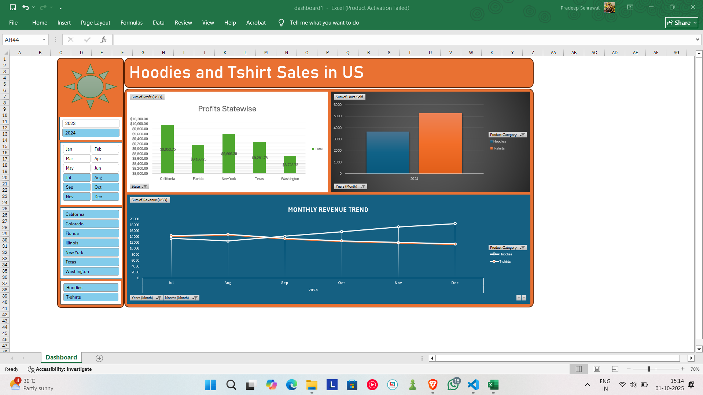

# US Apparel Sales Dashboard (Excel)

[](https://www.microsoft.com/en-in/microsoft-365/excel)
[](https://github.com/pradeep3114/us-apparel-sales-dashboard/stargazers)
[](https://github.com/pradeep3114/us-apparel-sales-dashboard/network/members)
[](https://opensource.org/licenses/MIT)

📊 This repository contains an interactive **Excel Dashboard** for analyzing **Hoodies and T-Shirts sales in the US**.  
It provides insights into profits, revenue trends, and product category performance across different states.

---

## 🚀 Features
- Statewise profit analysis
- Monthly revenue trend
- Product category comparison (Hoodies vs T-Shirts)
- Yearly filtering (2023 & 2024)
- Interactive slicers for Month, State, and Category

---

## 📸 Screenshots

### Dashboard View


---

## 🛠️ How to Use
1. Clone the repository:
   ```bash
   git clone https://github.com/pradeep3114/us-apparel-sales-dashboard.git
